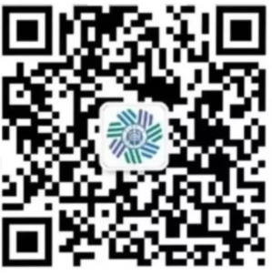

<h1 align="center">
    南审CFA编辑部介绍
     
</h1>

    <strong>🏆&nbsp;致力于CFA专业建设事业</strong>

# 组织历史

CFA编辑部是由南京审计大学金融学院CFA专业同学自发组织的公益学术性组织，组织成立于2019年9月，源于2019年南审CFA秋季交流分享会。在分享会上学长姐们认为当前线上交流的形式很好，并希望有组织能承接举办此类活动，让校内外交流常态化，从而提升专业凝聚力。

于是11月1日，CFA18级三位班长各推荐班级内两名同学，组成了首批9人的CFA编辑部。组织成立初期由已毕业的学长姐进行指导，主要以微信公众号的推广、QQ群视频交流的线上形式开展活动，活动主要面向CFA全体同学。

组织初期以发送微信公众号的推文为主，穿插学习由李一繁学长专门录制的Python视频，从而既能承接专业的新老互动交流，又能兼顾组织成员自身技能的提升。

通过组织对活动的不断摸索，形成了春秋季交流会、考研录取经验分享、老师图书推荐、金融时事新闻、CFA知识库等主要活动。为南审CFA的专业建设提供了较多的帮助，得到同学和老师们的广泛好评。

# 当前架构

目前编辑部由组策部、外宣部和研究部三个部门组成。

组策部负责编辑部老师的图书分享，对校外学长姐的采访，编辑部的资讯分享如金融热点事件、金融沙龙、考研考证等。

外宣部负责对校内学长姐、学弟妹的采访，与校外学长姐线下交流，编辑部的对外包装宣传如招新宣传、组织活动推广等。

研究部负责技术方法分享，编辑部内部技能培训如Python、金工、行业研究等。

编辑部每学期期末将进行绩效考核，对绩效考核中取得优异成绩的团队进行奖励。

##  2021-2022 CFA编辑部分工计划

| 成员名称 | 职务     | 负责方向                                                     |
| -------- | -------- | ------------------------------------------------------------ |
| 陈思润   | 总负责人 | 负责编辑部整体工作安排协调                                   |
| 谢政霖   | 负责人   | 负责编辑部内部技能培训，如Python、金工、行业研究等           |
| 程沛然   | 负责人   | 负责编辑部的对外包装宣传，如招新宣传、组织活动推广等         |
| 王秋怡   | 负责人   | 负责编辑部的老师推荐读书，以及对前辈采访的相关交流活动       |
| 张佳怡   | 负责人   | 负责编辑部的咨询分享推送，如金融热点事件、金融沙龙、考证考研等 |

# 未来展望

据已毕业的学长姐的去向可知，大部分CFA专业的同学集聚在长三角，尤其上海居多。后期组织计划能在CFA校友集聚的城市或省份搭建一个校友交流平台，让CFA专业的学生毕业后仍能经常在一起相聚，交流知识和成长。

我们希望凭借CFA编辑部的力量为在校生和研究生提供更好的知识交流环境、搭建一个沟通的桥梁；为已工作的学长姐提供更多研究合作和开办校友活动的机会；也为组织内部成员提供更多的机会和平台。虽然现在我们组织的力量尚弱，但是随着组织成员的成长、深造、工作、回馈，以及组织活动的一年一年的影响，相信CFA会越来越好！

# 联系我们

请关注CFA编辑部微信公众号**NAU Analyst**在后台留言：

# 活动推送

## 春秋季交流会系列

[2019年南审CFA春季交流会回顾](http://mp.weixin.qq.com/s?__biz=MjM5MTk5MTgxNg==&mid=2247483654&idx=1&sn=bc69e31237604334833cf16ed47842fd&chksm=a6ac506191dbd977447bfdd2299f3cebfd63c6bd64345fb54b69a4904dc52f0fa29822743d58&scene=21#wechat_redirect)

[2019年南审CFA秋季交流会回顾](http://mp.weixin.qq.com/s?__biz=MjM5MTk5MTgxNg==&mid=2247483668&idx=1&sn=0e0b23c359faa1a24566f4deafd15584&chksm=a6ac507391dbd9655e8f371873e9d559adac05f12307589c4fb976cb945f0254a1f18f500788&scene=21#wechat_redirect)

[2020年南审CFA春季交流会回顾](http://mp.weixin.qq.com/s?__biz=MjM5MTk5MTgxNg==&mid=2247483808&idx=1&sn=732acaf0dca6537097c0d19740c36597&chksm=a6ac50c791dbd9d127266936008ed4351b0cf803b0da0ec7ea028d4476106f040397300f76b1&scene=21#wechat_redirect)

[2020年南审CFA秋季交流会回顾](http://mp.weixin.qq.com/s?__biz=MzU5ODAzODM1Nw==&mid=2247485046&idx=1&sn=96b0d87c01d7fdc8b9235f6c6cbccee5&chksm=fe4b044cc93c8d5a4c923da09d0ec73d645cbc2c093e5c923e43d10dced995e60e732b0cf9d1&scene=21#wechat_redirect)

[2021年南审CFA春季交流会回顾](https://mp.weixin.qq.com/s?__biz=MzU5ODAzODM1Nw==&mid=2247485552&idx=1&sn=4d9ad50f6fcce72f3394aa5295b2f2e2&chksm=fe4b0a4ac93c835c33cb07c00ef875ffb43c2a125ee9f470b41c621e2354d9253390d619da10&token=2005506660&lang=zh_CN#rd)

[2021年南审CFA秋季交流会回顾（考研）](https://mp.weixin.qq.com/s?__biz=MzU5ODAzODM1Nw==&mid=2247486253&idx=1&sn=f7bd28046c3427df0e971e6cf8e2c34e&chksm=fe4b0917c93c8001abd17bbe8d1e89d0ce4f0116cd8999b18f66d0a9ba50e1a870c0eac69a4b&token=2005506660&lang=zh_CN#rd)  [2021年南审CFA秋季交流会回顾（留学）](https://mp.weixin.qq.com/s?__biz=MzU5ODAzODM1Nw==&mid=2247486267&idx=1&sn=f48265fb4ed367516aeb17239526cbe6&chksm=fe4b0901c93c8017178df00199fc59b93904bb96d4c3e7f316ac2f6419883fdb9b986ffbb1b9&token=2005506660&lang=zh_CN#rd)  [2021年南审CFA秋季交流会回顾（就业）](https://mp.weixin.qq.com/s?__biz=MzU5ODAzODM1Nw==&mid=2247486268&idx=1&sn=3f44c8c1c677a53f112f8164d64ca6f4&chksm=fe4b0906c93c80104aff6fc29491c1a9043e037948fde1034480b4ca5823f14da3518db16fad&token=2005506660&lang=zh_CN#rd)

# 历届成员

## 2019-2020 CFA编辑部（原CFA编辑小组）成员

- 李一繁 13级 CFA1班 总负责人
- 高镜骐 18级 CFA2班 负责人
- 徐博凡 18级 CFA3班 负责人
- 原禹欣 18级 CFA1班 负责人
- 丁诗琦 18级 CFA3班 负责人
- 孙天佑 18级 CFA1班 负责人
- 潘徐智 18级 CFA2班 负责人
- 郑志远 18级 CFA1班 负责人
- 王佳妮 18级 CFA2班 负责人
- 李清宇 18级 CFA3班 负责人

## 2020-2021 CFA编辑部（原CFA编辑小组）成员

- 高镜骐 18级 CFA2班 总负责人
- 徐博凡 18级 CFA3班 负责人
- 原禹欣 18级 CFA1班 负责人
- 丁诗琦 18级 CFA3班 负责人
- 陈思润 19级 CFA2班 高镜骐负责
- 谢政霖 19级 CFA1班 徐博凡负责
- 张佳怡 19级 CFA3班 徐博凡负责
- 王秋怡 19级 CFA2班 原禹欣负责
- 程沛然 19级 CFA1班 丁诗琦负责

## 2021-2022 CFA编辑部成员

- 陈思润 19级 CFA2班 总负责人
- 谢政霖 19级 CFA1班 负责人
- 张佳怡 19级 CFA3班 负责人
- 王秋怡 19级 CFA2班 负责人
- 程沛然 19级 CFA1班 负责人
- 吴彩艳 20级 CFA3班 陈思润负责
- 朱心怡 20级 CFA2班 陈思润负责
- 张晓菁 20级 CFA2班 谢政霖负责
- 宋天 20级 CFA1班 谢政霖负责
- 赵东暄 20级 CFA1班 张佳怡负责
- 陈彦霏 20级 CFA2班 王秋怡负责
- 罗睿一 19级 CFA1班 程沛然负责