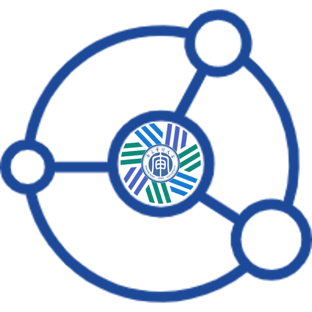
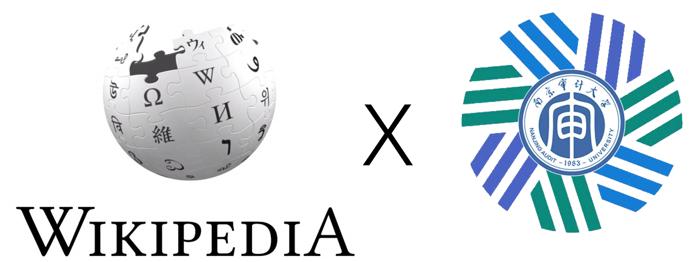
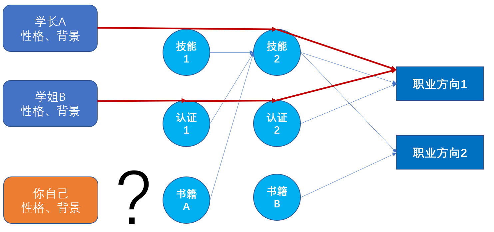

<h1 align="center">
    南审CFA知识库计划介绍
     
</h1>

# 项目概述

知识库计划是南审CFA编辑部发起的纯公益学术性项目，该项目将通过调研采访等方式来收集金融行业各职业发展方向所必备的相关技能和学习资料，帮助南审CFA在校生接触到真实的市场情况和职业技能需要，为自己的职业发展早做规划。

 

# 建设背景

随着南审CFA专业的不断发展，已经有越来越多的学长姐走上了工作岗位，在金融领域的各个方向发光发热。为了充分吸收学长姐们的成功经验、增强CFA专业上下级的互动交流，编辑部从2019年起持续组织了多期线上活动，邀请了数十位优秀的学长姐围绕着考研、留学和工作等主题进行分享讨论，解答了不少在校生的困惑，拉进了CFA校友们的距离。

但是随着活动的持续举办，我们也发现每年同学们都在关注同样的主题、面临着同样的职业规划烦恼，我们对这些问题进行了总结归纳，具体体现在：

**1** **缺少专业知识积累的仓库**。同学们每年都会找寻在当前阶段最适合自己的学习资料，这往往会耗费大量的时间成本，但其实这些资料前辈们都已经摸得很清楚了，只是缺少了一种类似维基百科的知识仓库将这些知识进行积累、分享和传承。

**2** **缺少主客观统一的知识经验梳理**。在往期组织的交流活动中，我们很高兴地看到CFA的同学们都很积极地向前辈们请教。通过观察，我们一方面发现每个人的成长路径都充满着主观能动性，经验借鉴的价值很大，但是盲目模仿可能就难以复刻；另一方面我们也发现很多职业需要的知识技能又都是客观共性的，努力学习储备这些能力准没错。不过无论是主观的经验借鉴还是客观的知识抽象，这都需要不小的工作。

**3** **缺少真实的市场需求信息**。如果将真实的市场需求比作用户、我们个体来比作产品的话，试问产品得具备怎样的能力才能满足用户的需求呢？这其实需要很充分的市场调研来指引方向，如果大的方向错了，产品的功能再强大对需求的响应也会大打折扣。由于学校区域位置的客观限制，导致大家难以在大学时就通过实习等方式进行“市场需求调研”，所以对周围充斥着的可能具备利益冲突的相关信息也难以辨识，最后往往就落人一步甚至误入歧途。

对以上问题，我们CFA编辑部决定开展**知识库计划**建设项目，将努力请教学长姐们的职业发展技能要求，充分梳理金融行业职业技能经验体系，构建并维护行业知识库，为南审CFA的学生们提供更丰富优质的学习资源和职业发展指引。

# 建设目标 

本项目计划**一个月围绕一个职业发展主题进行调研，计划每月产生一篇职业基础知识介绍和两篇及以上的经验分享**，届时会推送到公众号并更新到知识库当中。

我们将通过搜集职业相关背景资料以及和从事相关工作的学长姐进行交流的方式，将学长姐们的职业发展经验进行总结，并对该职业所需要的共性知识技能进行抽象，最终将这些知识经验都更新到知识库中。

我们的**知识库**将在Github进行持续更新维护：

**https://github.com/fcncassandra/naucfawiki**

也欢迎大家通过issue提交和公众号后台留言等方式给我们提出建议和支持，谢谢大家！